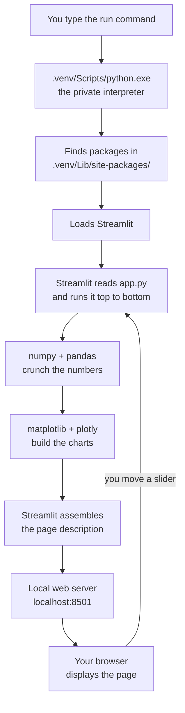

# How It All Works

A plain-language explanation of every moving part in this project: Python,
virtual environments, packages, `requirements.txt`, Streamlit, and how they fit
together.

No prior knowledge assumed. Every technical term is explained the first time it
appears.

---

## Part 1 — The big picture

When you type this command:

```powershell
& ".venv/Scripts/python.exe" -m streamlit run "01_Expectancy/app.py"
```

...five separate things happen. Here is the whole story in one paragraph, which
the rest of this document unpacks:

> You start a **private copy of Python** that lives in your project folder. You
> ask it to load a library called **Streamlit**. Streamlit reads your file
> `app.py` and runs it top to bottom. As it runs, your code calls functions like
> `st.slider()` and `st.plotly_chart()`, and Streamlit collects those into a
> description of a web page. Streamlit then starts a small **web server** on your
> own machine and opens your browser to view that page. When you move a slider,
> Streamlit runs your entire file again from the top with the new value and
> redraws the page.

That last sentence is the single most important idea in this project. We will
come back to it.

---

## Part 2 — Python, and what "running a script" means

### The interpreter

Python is two things with the same name:

1. **A language** — the rules for how you write the code.
2. **A program** — `python.exe`, which reads your code and does what it says.

That program is called the **interpreter**. "Interpreting" here means the same
thing as with human languages: it takes your instructions in one form and
carries them out.

When you run `python app.py`, you are launching the `python.exe` program and
handing it your file. It reads your file **one line at a time, from top to
bottom**, and performs each instruction before moving to the next.

This is worth stressing because it explains a lot of Streamlit's behaviour
later: Python does not "look ahead." Line 40 has no idea line 50 exists until it
gets there.

### What `-m` means

You will see two styles of command:

```powershell
python app.py           # "run this file"
python -m streamlit     # "run this installed library as a program"
```

`-m` stands for **module**. A module is just a Python file that someone else
wrote and you installed. Some modules are designed to be run as programs, not
just imported into your code — Streamlit is one of them.

Saying `python -m streamlit` means *"Python, go find the Streamlit library you
have installed, and run it."* This is more reliable than typing `streamlit`
directly, because it removes any doubt about **which** Python is being used —
and as the next part explains, you have more than one.

---

## Part 3 — Packages: using other people's code

### What a package is

You do not write everything yourself. Drawing a chart, reading a spreadsheet,
running a web server — other people have already solved these and published the
solutions.

A **package** (also called a **library**) is a bundle of Python files someone
else wrote, that you can download and use in your own code. They mean the same
thing in practice; "library" emphasises what it does, "package" emphasises how
it's distributed.

Using one looks like this:

```python
import numpy
```

That line means *"find the package called numpy and make its tools available in
this file."*

### Where packages come from: PyPI and pip

**PyPI** (the Python Package Index, pronounced "pie-pee-eye") is a giant free
public warehouse of packages. Around half a million of them.

**pip** is the program that fetches packages from PyPI and installs them on your
machine. When you run:

```powershell
python -m pip install pandas
```

pip contacts PyPI, downloads pandas, and puts it somewhere Python can find it.

### The packages in this project

| Package | What it does, in one sentence |
|---|---|
| **numpy** | Fast maths on big lists of numbers. |
| **pandas** | Spreadsheet-like tables in code — rows, columns, filtering, grouping. |
| **matplotlib** | Draws static charts and saves them as images. |
| **plotly** | Draws interactive charts you can zoom and hover over. |
| **streamlit** | Turns a Python script into a web page with controls. |

### Dependencies: packages that need other packages

Here is where it gets interesting. When you installed those five packages, you
actually got about **45**.

That's because packages use other packages. Streamlit needs a web server, so it
pulls in `uvicorn`. Plotly needs to convert data formats, so it pulls in
`narwhals`. Those packages have their own needs, and so on down the chain.

A package that another package needs is called a **dependency**. The five you
asked for are **direct dependencies**; the other forty that arrived
automatically are **transitive dependencies** ("transitive" meaning they came
along indirectly, through a chain).

pip works this whole chain out for you and installs everything needed.

---

## Part 4 — Virtual environments: the core idea

This is the concept most worth understanding properly, so we'll build up to it.

### The problem

Imagine you have two projects on one computer:

- **Project A** — an old one that needs pandas version **1.5**
- **Project B** — this one, which needs pandas version **3.0**

If packages were installed in one shared place for your whole computer, you
could only ever have one version of pandas installed. Installing the version
Project B needs would break Project A. There is no arrangement that makes both
work.

This is sometimes called **dependency hell**, and it used to be a genuine daily
misery.

### The solution

Give every project its own private, sealed-off set of packages.

Project A gets its own pandas 1.5. Project B gets its own pandas 3.0. Neither
can see the other's packages. Neither can break the other.

That private set of packages — plus its own copy of Python — is called a
**virtual environment**. Usually shortened to **venv**.

The word "virtual" is doing something specific here. Nothing is being simulated
or emulated — it's not a virtual machine. It means the environment *acts as
though* it were the whole Python installation on your computer, even though it's
just one folder among many.

### What a venv actually is — it's just a folder

This is the part people find surprising. A virtual environment is not a special
system feature or a background service. **It is an ordinary folder.**

You created it with:

```powershell
python -m venv .venv
```

Which means: *"Python, use your built-in `venv` tool to build me a new
environment, and put it in a folder called `.venv`."*

Look inside and you find this:

```
.venv/
├── Scripts/                  (called "bin/" on Mac and Linux)
│   ├── python.exe            ← a copy of the Python interpreter
│   ├── pip.exe               ← this venv's own package installer
│   ├── streamlit.exe         ← shortcut created when Streamlit was installed
│   └── Activate.ps1          ← convenience script, explained below
├── Lib/
│   └── site-packages/        ← ★ every installed package lives here
│       ├── numpy/
│       ├── pandas/
│       ├── streamlit/
│       └── ...about 45 folders
└── pyvenv.cfg                ← small text file with settings
```

The starred folder, **`site-packages`**, is the heart of it. That is simply
where Python looks for installed packages. Every package you install with pip
is copied into that folder as ordinary files.

So "installing a package into a virtual environment" means, literally: *copying
a folder of Python files into `.venv/Lib/site-packages/`.* Nothing more mystical
than that.

### How Python knows where to look

When your code says `import pandas`, Python needs to find pandas. It does this
by checking a list of folders, in order, until it finds a match. That list is
called the **search path**.

Here's the trick that makes venvs work: **when you run
`.venv/Scripts/python.exe`, it puts its own `site-packages` folder at the top of
that search list.** It deliberately ignores the system-wide one.

That's the entire mechanism. There's no sandboxing, no isolation technology, no
magic. It's just *"look in this folder first, and don't look in the other
one."*

This also explains the most common error you'll hit:

```
ModuleNotFoundError: No module named 'streamlit'
```

It means you ran the **wrong** Python. The system-wide `python.exe` searched
*its* `site-packages`, Streamlit wasn't there (it's in the venv's), so it gave
up. The fix is always the same: use the full path to the venv's Python.

### What "activating" a venv does

You may have seen this:

```powershell
.\.venv\Scripts\Activate.ps1
```

This is pure convenience. It edits one setting in your current terminal window —
a list called `PATH`, which tells the terminal where to look for programs — so
that typing `python` finds the venv's copy first.

After activating, these two commands are identical:

```powershell
streamlit run 01_Expectancy/app.py            # short, after activating
& ".venv/Scripts/python.exe" -m streamlit run "01_Expectancy/app.py"   # always works
```

Activation only affects **that one terminal window**, and only until you close
it. It doesn't change anything permanently, and it certainly doesn't need admin
rights. Typing `deactivate` undoes it.

The long form always works whether you've activated or not, which is why the
README uses it — one less thing to get wrong.

### Why this means no admin rights

Installing software "for everyone on this computer" writes to protected areas
like `C:\Program Files`, and Windows demands administrator permission for that.

A venv writes only to `C:\GIT - Personal\TradingFundamentals\.venv\`. That's
inside your own user folder, which you already own. Windows has no objection.

Everything in this project stays inside the project folder. That is precisely
why the admin constraint is a non-issue.

### Why the venv is not in Git

Three independent reasons, each sufficient on its own:

1. **Size.** Roughly 400 MB of files that change every time you install
   anything.
2. **Absolute paths.** The file `pyvenv.cfg` and every `.exe` in `Scripts/` have
   the full path to *your* machine's Python written inside them. Move the folder
   to a different computer — or even a different folder on the same computer —
   and those paths point at nothing.
3. **Compiled code.** Packages like numpy and pandas aren't purely Python. For
   speed, parts are written in C and compiled into machine code for one specific
   operating system and one specific Python version. A Windows build physically
   cannot run on a Mac.

So the venv is treated as **disposable**. Delete it any time; rebuild it in two
minutes. Nothing of value is stored there.

---

## Part 5 — `requirements.txt`: the recipe

If the venv can't travel between machines, how does a different computer get the
same setup?

You don't ship the ingredients. You ship the **shopping list**.

```
streamlit==1.64.0
pandas==3.0.6
numpy==2.5.3
matplotlib==3.11.2
plotly==7.1.0
```

That file is small enough to email, and it's stored in Git. On a new machine:

```powershell
python -m venv .venv                                        # empty environment
& ".venv/Scripts/python.exe" -m pip install -r requirements.txt   # fill it
```

`-r` means *"read the list from this file"*. pip works down the list, fetches
each package from PyPI along with all its dependencies, and you end up with an
identical environment.

### Why the `==` matters

Compare two versions of that file:

```
pandas              # "give me whatever is newest"
pandas==3.0.6       # "give me exactly this version"
```

The first is a trap. It works fine today. But rebuild the project in a year and
pip will fetch pandas 4.0, which may have renamed functions or changed how
something behaves — and your app breaks, on a new machine, when you're least
equipped to debug it.

Locking a version with `==` is called **pinning**. It means the environment you
rebuild in two years is the same one that works today. When you *do* want newer
versions, you change the number deliberately and re-test — rather than being
ambushed.

---

## Part 6 — Streamlit: what it actually is

### The problem it solves

You've written Python that calculates something useful. Now you want sliders and
charts instead of editing numbers in the source code every time.

Traditionally you'd have two bad options:

- **Build a desktop application** — learn a whole windowing toolkit, write
  hundreds of lines to place buttons and wire up click handlers.
- **Build a website** — learn HTML, CSS, JavaScript, and a web framework, then
  wire the browser up to your Python. That's three extra languages.

Streamlit removes both. You write **ordinary top-to-bottom Python**, and it
produces a web page.

### What happens when you run it

```powershell
python -m streamlit run 01_Expectancy/app.py
```

Streamlit does four things:

1. **Starts a web server on your own computer.** A web server is just a program
   that waits for requests and sends back pages. Normally these live in data
   centres; this one runs on your laptop and is reachable only from your laptop.
2. **Runs your script**, top to bottom, like any Python file.
3. **Collects every `st.` call** as it goes. When your code hits
   `st.slider(...)`, Streamlit notes "put a slider here." When it hits
   `st.pyplot(fig)`, it notes "put this chart here." Your code isn't drawing
   anything — it's building a list of instructions.
4. **Opens your browser** and sends it that list, rendered as a web page.

### "Local" and "localhost" and "port"

The terminal prints something like `http://localhost:8501`. Three terms:

- **localhost** — a reserved name meaning *"this very computer."* A browser
  asking for localhost never touches the internet; the request doesn't leave the
  machine. Nothing is uploaded, nothing is shared, and nobody else on your
  network can reach it.
- **port** — a numbered doorway on your computer. One machine can run many
  network programs at once, so each claims a different number to keep their
  traffic separate. Streamlit uses **8501** by default. `Port already in use`
  just means another program grabbed that number first.
- **server** — a program that waits for requests and responds. "Server"
  describes a role, not a big machine in a basement.

So the browser is being used purely as a **display surface**. Streamlit could
have drawn its own window, but browsers already know how to render text, tables,
and interactive charts beautifully — so it borrows one.

### The rerun model — the key idea

This is the one concept that makes Streamlit click, and it surprises everyone at
first:

> **Every time you touch any control, Streamlit runs your entire script again,
> from line 1.**

Move a slider from 100 to 110, and your whole `app.py` executes again from the
top. Imports, calculations, charts — everything. Then Streamlit compares the new
page to the old one and updates only the parts that changed, so it looks smooth.

Why on earth do it this way? Because it removes an entire category of
complexity. In a normal application you'd write "when the slider moves, update
the chart, and also update the metric, and also recalculate the table" — an
ever-growing web of connections you must maintain by hand, and which goes wrong
when you forget one.

Streamlit's answer: don't track changes at all. Just redo everything. Your
script always describes the page **as it should look right now**, given the
current control values. There is no stale state to manage, because nothing
persists.

Running it all again sounds wasteful, and for heavy work it would be — which is
why Streamlit offers caching (`@st.cache_data`) to skip recomputing things that
haven't changed. But for a script that finishes in milliseconds, the simplicity
is an enormous win.

### How a widget returns a value

Look at this line from [01_Expectancy/app.py](01_Expectancy/app.py):

```python
n_trades = st.slider("Number of trades", 10, 500, 100, step=10)
```

A **widget** is any on-screen control — slider, button, dropdown, text box.

That single line does two jobs at once:

1. Tells Streamlit to draw a slider labelled "Number of trades", ranging 10 to
   500, starting at 100.
2. **Immediately returns the slider's current value**, which gets stored in
   `n_trades`.

On the first run nobody has touched it, so it returns the default: `100`. You
drag it to 250. Streamlit reruns the script from the top. This time the same
line returns `250`. Every calculation below it now uses 250 — automatically,
with no event handlers, no callbacks, no wiring.

That's the whole programming model. Widgets are just functions that return their
current value, and the script re-runs to reflect it.

---

## Part 7 — Walking through `app.py`

With all that in place, here's what the smoke test actually does.

### Imports

```python
import sys
import matplotlib
import matplotlib.pyplot as plt
import numpy as np
import pandas as pd
import plotly.express as px
import streamlit as st
```

Each line loads a package from `site-packages`. The `as` part creates a
nickname: writing `np.array(...)` instead of `numpy.array(...)`. These
particular abbreviations (`np`, `pd`, `st`, `plt`, `px`) are near-universal
conventions — you'll see them in every tutorial and every codebase.

`sys` needs no install; it's built into Python itself.

### Choosing a drawing backend

```python
matplotlib.use("Agg")
```

matplotlib can either open a desktop window or draw silently into memory. A
**backend** is which of those it uses. `"Agg"` means "don't open a window, just
produce an image" — correct here, since the picture is destined for a browser,
not a pop-up window on the server.

### Generating fake trades

```python
rng = np.random.default_rng(42)
wins = rng.random(n_trades) < win_rate
results = np.where(wins, avg_win, -avg_loss)
```

Line by line:

- `default_rng(42)` creates a random number generator. The `42` is a **seed** —
  a starting point. Computer randomness is calculated, not truly random, so the
  same seed always produces the same sequence. That's deliberate: it makes the
  app reproducible, so the chart doesn't jump around every time you nudge an
  unrelated control.
- `rng.random(n_trades)` produces that many numbers between 0 and 1.
- `< win_rate` compares every one of them at once, giving a list of true/false.
  With a win rate of 0.45, roughly 45% come out true. This is how you simulate
  weighted coin flips.
- `np.where(wins, avg_win, -avg_loss)` builds the outcomes: where it's a win, use
  `avg_win`; otherwise use `-avg_loss`.

Notice none of these use a loop. numpy applies operations to entire lists in one
go — this is called **vectorisation**, and it's both faster and shorter than
looping over each trade.

### Building the table

```python
df = pd.DataFrame({
    "trade":    np.arange(1, n_trades + 1),
    "result_r": results,
    "equity_r": results.cumsum(),
})
```

A **DataFrame** is pandas' table type: named columns, numbered rows, exactly
like a spreadsheet. `df` is the conventional variable name.

`cumsum()` is a **cumulative sum** — a running total. Given `[2, -1, 2]` it
returns `[2, 1, 3]`. That running total of trade results *is* your equity curve.

### The expectancy calculation

```python
expectancy = win_rate * avg_win - (1 - win_rate) * avg_loss
```

$$E = W \cdot A_w - (1 - W) \cdot A_l$$

In words: what you expect to make on an average win, weighted by how often you
win, minus what you expect to lose on an average loss, weighted by how often you
lose. If the result is positive, the system makes money over enough trades.

Everything above this line is plumbing. This is the actual idea the project
exists to explore.

### Drawing

```python
st.dataframe(df.head(10), width="stretch")
```

Shows the first 10 rows as a sortable table. `width="stretch"` means fill the
available width.

```python
col_left, col_right = st.columns(2)
with col_left:
    ...
```

Splits the page into two side-by-side columns. Anything inside a `with` block
goes into that column. The same equity curve is then drawn twice — once with
matplotlib (a static image) and once with plotly (interactive: hover, zoom,
pan) — purely so you can compare them and pick a favourite for the real work.

---

## Part 8 — How the pieces fit together



That loop at the bottom is the rerun model: interacting with the page sends the
new value back, and the script runs again from the top.

### Which files matter, and why

| File or folder | Committed to Git? | Purpose |
|---|---|---|
| `01_Expectancy/app.py` | Yes | Your actual work. |
| `requirements.txt` | Yes | The recipe for rebuilding the venv. |
| `.streamlit/config.toml` | Yes | App settings, shared across machines. |
| `README.md` | Yes | How to set up and run. |
| `.gitignore` | Yes | The list of things Git should ignore. |
| `.venv/` | **No** | Machine-specific, disposable, rebuildable. |
| `__pycache__/` | **No** | Speed-up files Python generates automatically. |

The rule of thumb: **commit what you wrote, ignore what was generated.**

---

## Part 9 — Glossary

| Term | Meaning |
|---|---|
| **Interpreter** | The `python.exe` program that reads and executes your code. |
| **Package / library** | A bundle of reusable code written by someone else. |
| **Module** | A single Python file that can be imported. |
| **PyPI** | The public online warehouse of Python packages. |
| **pip** | The tool that downloads and installs packages from PyPI. |
| **Dependency** | A package that another package needs in order to work. |
| **Transitive dependency** | A dependency of a dependency — installed automatically. |
| **Virtual environment (venv)** | A folder holding a private Python and its own packages, isolated from other projects. |
| **site-packages** | The folder inside a venv where installed packages physically live. |
| **Search path** | The ordered list of folders Python checks when you `import` something. |
| **Activate** | Temporarily adjust a terminal so `python` means the venv's copy. |
| **Pinning** | Locking a package to an exact version with `==`. |
| **Server** | A program that waits for requests and sends back responses. |
| **localhost** | A name meaning "this same computer" — traffic never leaves the machine. |
| **Port** | A numbered channel letting multiple network programs coexist. Streamlit uses 8501. |
| **Widget** | An on-screen control: slider, button, dropdown, text box. |
| **Rerun** | Streamlit re-executing your whole script after any interaction. |
| **DataFrame** | pandas' spreadsheet-like table of rows and columns. |
| **Vectorisation** | Operating on a whole list of numbers at once instead of looping. |
| **Seed** | A fixed starting point that makes "random" numbers repeatable. |
| **Backend** | Which drawing engine matplotlib uses; `Agg` means "image, no window". |
| **Git** | The tool that records the history of your files. |
| **Repository (repo)** | A folder whose history Git is tracking. |

---

## Part 10 — The three ideas worth remembering

If everything else fades, keep these:

1. **A venv is just a folder containing its own Python and its own packages.**
   Isolation works by looking in that folder first and ignoring the system one.
   It's disposable — delete and rebuild freely.

2. **`requirements.txt` is the portable artefact, not the venv.** You move the
   shopping list between machines and rebuild the environment there, because the
   environment itself has your machine's paths and compiled binaries baked in.

3. **Streamlit reruns your entire script on every interaction.** Widgets are
   functions that return their current value. There are no event handlers to
   write — your script simply describes what the page should look like right
   now.
